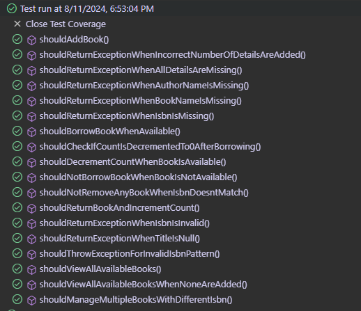
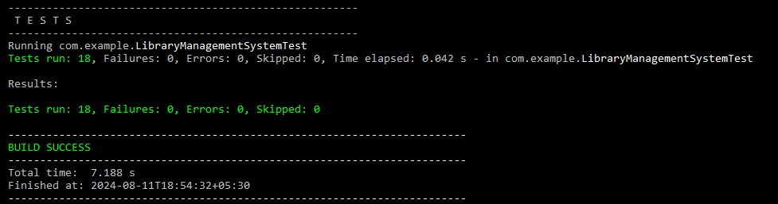

# Library Management System Kata

This is an Exercise that follows the TDD approach tests first, implementing methods to pass those tests, and refactor the code

## How Does it work
This program is written in TDD format and is written step by step.

Create a LibraryManagement System Class that is responsible for managing the collection of books in the
library. It implements the BookManager interface and interActs with the BookInventory interface to keep track of each book in the collection

Books class is responsible for maintaining the state of books and creating new books

Simple Book Inventory class is used to provide an implementation for BookInventory to keep track of the number of books when they are borrowed or returned

The book Inventory Interface is responsible for declaring methods to count the books currently in the library 
and increment and decrement function

Book Manager interface is responsible for declaring methods for adding books and viewing book in the library

The book not available Exception is raised when a person tries to borrow a book that doesn't exist in the system

The invalidbookdetails Exception is raised when invalid details for the book are added when the book is added, an exception will be raised when the book name is missing, author name is missing,isbn number is missing or publication year is missing

## Test Results

## How to run?
Clone this repo

Run the test by librarymgmt/tree/main/src/test/java/com/example/LibraryManagementSystemTest.java

Result of tests

## Version and library used

Java Version: java 16.0.2

Test Version:JUNIT

